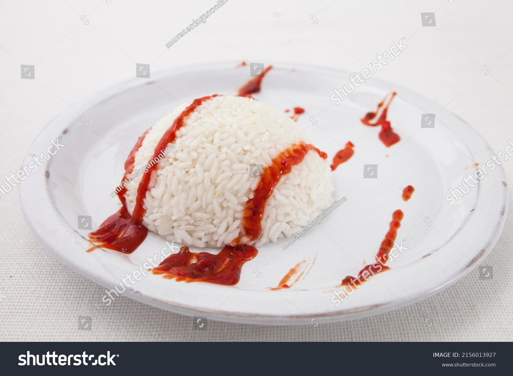

## **About Me**
<!--  -->

 

Hello I'm Matthew Wakayama, and I am 15 years old. I go to [Del Norte High School](https://delnorte.powayusd.com/). I am currently taking Honors Humanities, Ap Chemistry, Ap Computer Science, Ap Calculus, and Spanish. If you want to watch a quality espanol video:

 Outside of school I swim for a club called [Pacific Swim](https://pacificswim.com/). 

<!--  -->

Future Plans:
- Create an image carousel for user interaction
- Incorporate python 

Problems i had with carousel:
- getting image to load, it was because of a 
- learning a lot about formatting and referencing html classes 
- workflow between java css and the html. How you can parse through to find certain classes "my slides"
- making the video not have a link showing, wrap the link with the jpg

<!-- - Plans, Lists, [Scrum Boards](https://clickup.com/blog/scrum-board/) help you to track key events, show progress and record time.  Effort is a big part of your class grade.  Show plans and time spent!
- [Hacks(Todo)](https://levelup.gitconnected.com/six-ultimate-daily-hacks-for-every-programmer-60f5f10feae) enable you to stay in focus with key requirements of the class.  Each Hack will produce Tangibles.
- Tangibles or [Tangible Artifacts](https://en.wikipedia.org/wiki/Artifact_(software_development)) are things you accumulate as a learner and coder.  -->
